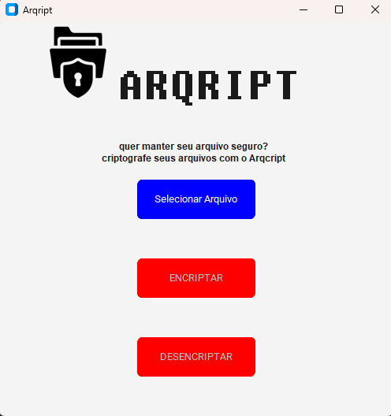

# Sobre o projeto

Titulo: Arqcript

    Este projeto consiste em criptografar e descriptografar arquivos. O programa possui uma interface dinamica e simples sendo assim fácil de ultiliza-la. 

# Requisitos

[Requerimentos do projeto](requirements.txt)

# Contatos do desenvolvedor
John Everton Marques dos Santos

telefone: (31)99762-3668

E-mail: evertonjohn097@gmail.com

